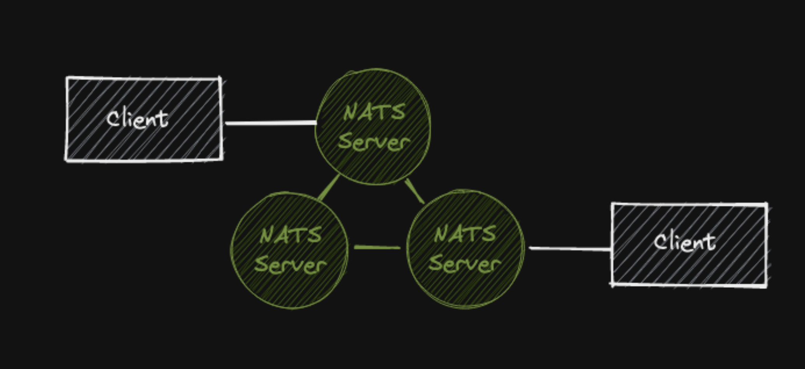
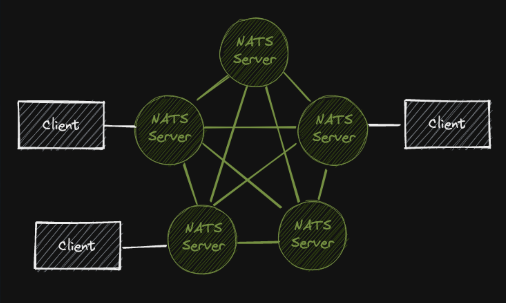
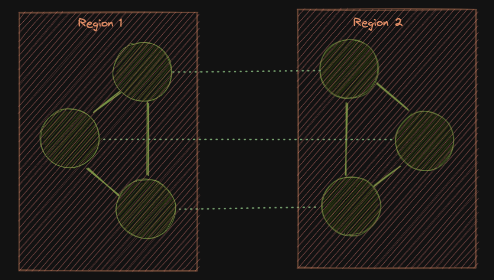
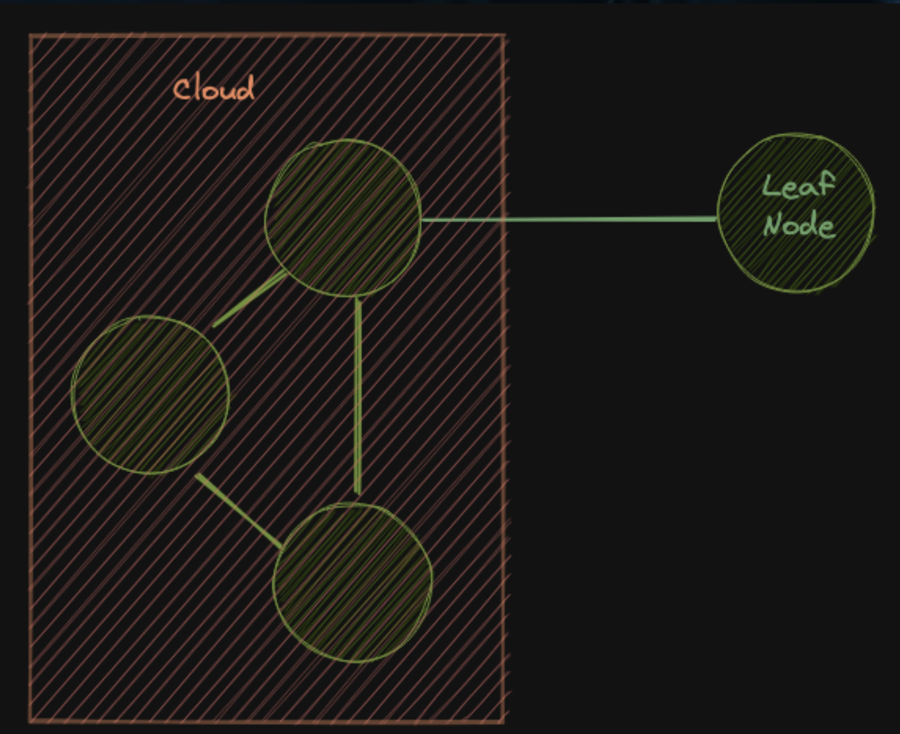
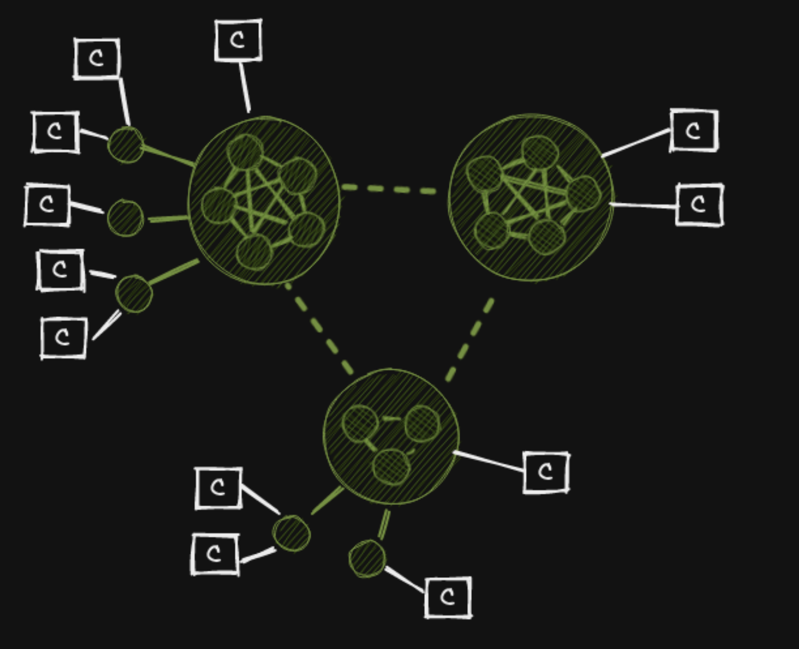

autoscale: true
footer: @synadia
background-color: #1E1E1E
text: #A7ADB2, alignment(left), line-height(0.95), Inter
header: #ECEDEE, alignment(left), line-height(1), Inter Extra Bold
text-strong: #FFFFFF, Inter Bold 
header-strong: #32C9BF
list: bullet-character(•)
theme: Fira, 5
slide-transition: true
slidenumbers: true
build-lists: true

## **Rethinking Connectivity** Hyper-connectivity and the Intelligent Edge
#### Jeremy Saenz | Synadia
---

# Jeremy Saenz

[.column]
- Long time software engineer in multiple industries
- Currently working @synadia on **NATS**
- Moved from Engineer -> Product and back again

[.column]

---

# NATS is adaptive... And so is this talk
grandslam.vercel.app

---

## Rethinking Connectivity
### **Multi-cloud** and **Edge** computing is driving a massive transformation

---

# Limitations of Today's Technology

- **DNS/hostnames/IP** based discovery
- **Pull based** request/reply semantics
- **Perimeter based** security
- **Location-dependent** backends
- Many layers built on **HTTP 1:1** communication

---

## Introducing NATS

---

# Introducing NATS
NATS is an **open source**, **high performance** messaging system and **connective fabric**.

It aims to **simplify** the number of technologies you use for your services to communicate, while also **empowering** you to build systems that are **globally available**, **multi-cloud**, **multi-geo**, and **highly adaptive** to change and scale.

---

# Introducing NATS
- Location-independent addressing
- M:N communications
- Push and pull based
- Decentralized and secure multi-tenancy
- Intelligent persistence
- Global scale

---

# Introducing NATS
- **Server:** simple, small, easy to deploy Go binary
- **Client:** 40+ client libraries in various languages

---

## NATS Core

---

# NATS Core
* Fire and forget message publishing
* Very fast - Scales to millions of msg/s on a single instance
* Flexible subject based addressing with wildcards
* Payload agnostic

---

# NATS Core
* **Request** and **Reply**
* **Publish** and **Subscribe**
* **Fan In** and **Fan Out**
* **Load Balancing** via **Queue Groups**

---

## NATS Core Demo

---

## Intelligent Persistence with NATS JetStream

---

# What is JetStream?
JetStream is a next-gen persistence layer built on top of NATS Core that stores.

It is multi-tenant, highly configurable and globally scalable.

---

# What is JetStream?
- **Secure** data streams with **multiple consumer models**
- **Multiple streaming patterns** supported (queues, logs, replays, compaction)
- **Multiple QOS** supported (at least once, exactly once)
- **Digital twins**/**replicated data**
- **Mux** and **Demux** data
- **Materialized views:** key/value and object stores

---

## NATS at a Global Scale

---

# Global Scale and Diversity
- **Single Server** - Millions of messages per sec. ~70GiB throughput
- **Clusters and Superclusters** - Fully meshed groups of servers that can span the globe
- **Leaf Nodes** - Extend a NATS system with your own private island

---

# Single Server

---

# Cluster

---

# 5 Node Cluster

---

# Supercluster

---

# Leaf Node

---

# Massive Scale

---

## NATS at the Edge with Leaf Nodes

---

# What is a leaf node?
- An extension to a NATS system of any size
- Supports separate operation/security domains
- Can operate normally without a connection to the hub

---

# What are leaf nodes good for?
- Extending a hub (hub and spoke topologies)
- Bridging NATS systems
- Connectivity at the Edge
    - Store and forward
    - Command and Control
    - Fleet Management

---

# Leaf node use cases
- Factories -> Cloud
- Retail Sites -> Cloud
- Planes, Trains, Automobiles

---

# Leaf node use cases
- Partner sites
- OEM
- Multi-prem deployment

---

# Resources

- https://nats.io
- https://rethink.synadia.com
- https://natsbyexample.com

---

# Questions?

